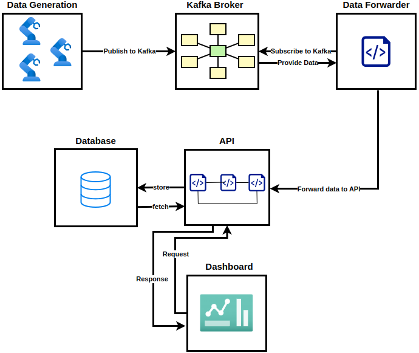

# IoT Analytics Project
 
## What is it?

It is an end-to-end solution that simulates a hypothetical infrastructure where various 
hypothetical industrial devices are located, these devices produce timeseries data for voltage and electrical current.
 Next, these data are published in a kafka topic, on the meantime, there is another service that collects the 
published data and forwards them via to an API that stores them in a timeseries database.
Finally, there is a dashboard where a user can select the available devices and see visualized statistics and plots fpr
the selected device.

&nbsp;

### Here is an abstract view of the project

## How It Works

1. Data Generation script sends IIoT signals (current, voltage) to Kafka. 
2. Data Forwarder consumes messages from Kafka and forwards it to the API. 
3. Database stores the incoming time-series data. 
4. Dashboard interracts with database via the API and visualizes real-time trends, distributions & anomalies for selected device(s) 

## Tech Stack

**Python** – Data generation, processing, and API 
**Kafka** – Real-time messaging 
**FastAPI** – API services 
**QuestDB** – Time-series data storage 
**Streamlit** – Intuitive visualization 

# Dashboard Demo:

### Step 1 - Select Device
When selectin a dive you will immediately see the line plots for electrical current and voltage

### Step 1.1 - View statistics

### Step 1.2 - View Histograms and KDE from data
If you scroll down you can observe the histograms along with the KDE curves

### Step 2 - Anomaly detection section

### step 2.1 - Interact with Anomaly detection functionality
Here in the electrical current, we specified the `value_based` method
where we stated that values below **22.67** or above 90.21 to be flagged as anomalies. 
Additionally, we have selected in voltage the `quantile` method, and specified whatever belongs to less than **0.12** percentile
or is greater than **0.67** percentile to be flagged as anomaly.  
